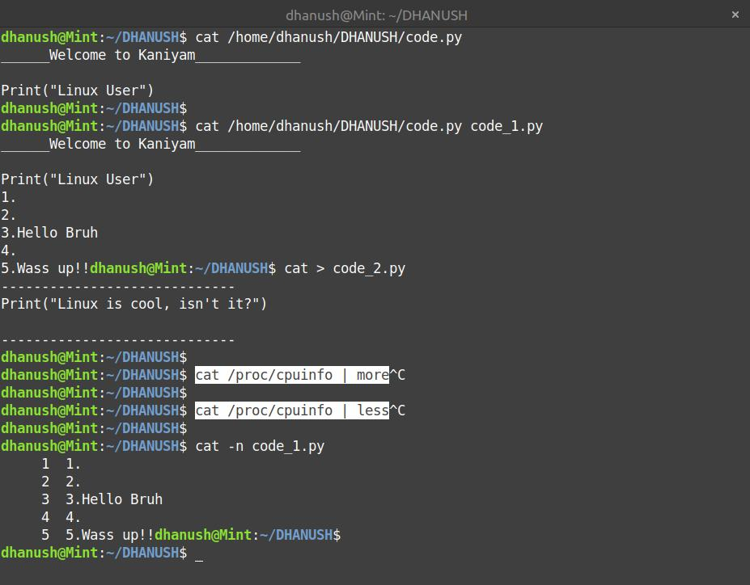

# Cat

cat command is used to concatenate files and print them to the standard output.

To display contents of file
```
cat /etc/group
```

To view contents of multiple files
```
cat file3.txt file4.txt
```

To create a file with cat command
```
cat > file5.txt
```
CTRL+D to save the file


To view cat command with large file size
```
cat /proc/cpuinfo | more
cat /proc/cpuinfo | less
```


To display line numbers in file
```
cat -n number.txt
```

### Screenshot


